# Go Dump Tool

## Overview

The Go Dump Tool is a utility designed to facilitate the extraction and dumping of data from a database into CSV files. 

## Supported Databases

Currently, the Go Dump Tool supports dumping data from PostgreSQL databases to CSV files.

## Features

- Efficient data extraction
- Chunking to reduce memory usage
- Customizable configuration
- Easy to use

## Demo



## Installation

To install the Go Dump Tool, follow these steps:

1. Clone the repository:
    ```sh
    git clone https://github.com/realhugn/go-dump.git
    ```
2. Navigate to the project directory:
    ```sh
    cd go-dump
    ```
3. Build the tool:
    ```sh
    go build
    ```

## Usage

To use the Go Dump Tool, run the following command:
```sh
./go-dump --config /path/to/config.yaml
```

Replace `/path/to/config.yaml` with the path to your configuration file.

## Customization

Customize the tool by setting the following parameters in a `config.yaml` file:

```yaml
chunk_size: 100000
db_user: changeme
db_password: changeme
db_host: changeme
db_port: changeme
db_name: changeme
tables:
    - name: changeme
      columns: [] # If not specified, then select all columns
      output_dir: changeme
    - name: changeme
      columns: [] # If not specified, then select all columns
      output_dir: changeme
concurrently: true # If true, data will be dumped concurrently. Else, synchronously.
```

Adjust these values according to your database configuration and requirements.